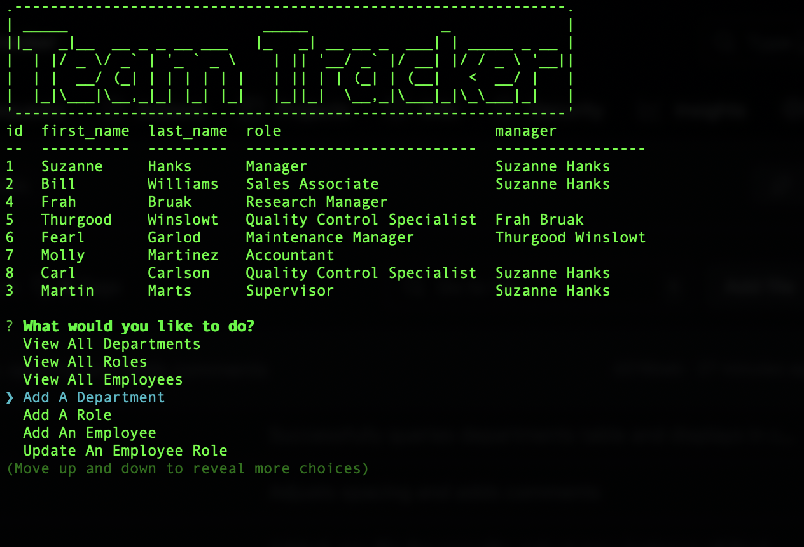

# team-tracker

## Description
A command line employee-tracker application that allows a user to manage their workforce and keep track of departments, employees, roles, managers, and make changes to employee role and manager information.  This application uses node.js and postgreSQL to query a database and add and update department, role, and employee information and view data in a neat table format right in the user's console.  The most challenging (and educating) part of this challenge was learning to work with the asyncronous nature of javascript and get the functions to run when I needed them to, as well as compiling all the necessary query information together in the right order in order to achieve the query results I needed.

For future development of this application I would like to continue to work on adding features to view employees by manager, view employees by department, delete roles, departments, or employees, and see all budget information by department.  

## Table of Contents
* [Installation](#installation)
* [Usage](#usage)
* [License](#license)
* [Contributing](#contributing)
* [Credits](#credits)
* [Tests](#tests)
* [Questions](#questions)

## Installation
Installation instructions for application:
npm i

## Usage
Click [here]() for a video demonstration of the application.

After cloning the repository, ensure the following are installed: node.js, postgreSQL, and any dependencies used in the application by running npm i. Create a .env file in the root of the application to enter credentials to connect to postgreSQL to ensure connection to the database.  Log into postgreSQL and run the schema.sql file and seeds.sql to get the database started.  To run the application, enter node server.js in the command line.  The application will start and the user will be given a choice of what actions to take:

* View All Departments: The user can view any current department data in the database on a table that shows the department name and id of department.

* View All Roles: The user can view all the current role data in the database: role id, title of role, department role belongs to, and the salary amounts for each role.

* View All Employees: The user can view all the current employee data in the database.  The employee's id, first and last names, employee's role, and who their manager is. 

* Add A Department: Here the user can add a department to the database by following the prompt to input the department name.  The department will be added to the departments table in the database.

* Add A Role: The user can add a role to the roles table in the database.  They will be asked a series of prompts about the role: role title, salary for role, and which department the role belongs to.  The role will then be added to the database.

* Add An Employee: The user can add an employee to the employees table in the database.  They can fill in the employee's first and last name, select a role for the employee, and select who the employee reports to as their manager.  

* Update Role: Here the user can update an employee role if an employee changes roles or gets promoted (or demoted).  The application will ask the user which employee they would like to update, and then it will ask what role should be assigned.  The information will automatically update in the database.

* Update Employee Manager: The user can update who the employee reports to.  Very similar to updating the role, the user will be given a choice which employee to update, then a list of who their new manager is.  Making these selections will automatically update in the database, as well as provide a confirmation message for clarity about who now reports to whom.

* Cancel: Cancel exits the application, clears the console, and takes the user back to the root folder of the application.

## License
This project is operating under the MIT license.  For more detailed information, please click [here](https://opensource.org/license/mit).

## Contributing
See contact information for contributions

## Credits
[ACII art](https://www.asciiart.eu/text-to-ascii-art) for application logo.

## Tests
To run tests for the application:
N/A

## Questions
Contact me for any questions regarding this project:

GitHub: [lindsay-terry](https://github.com/lindsay-terry)

Email: lindsaytee66@gmail.com

